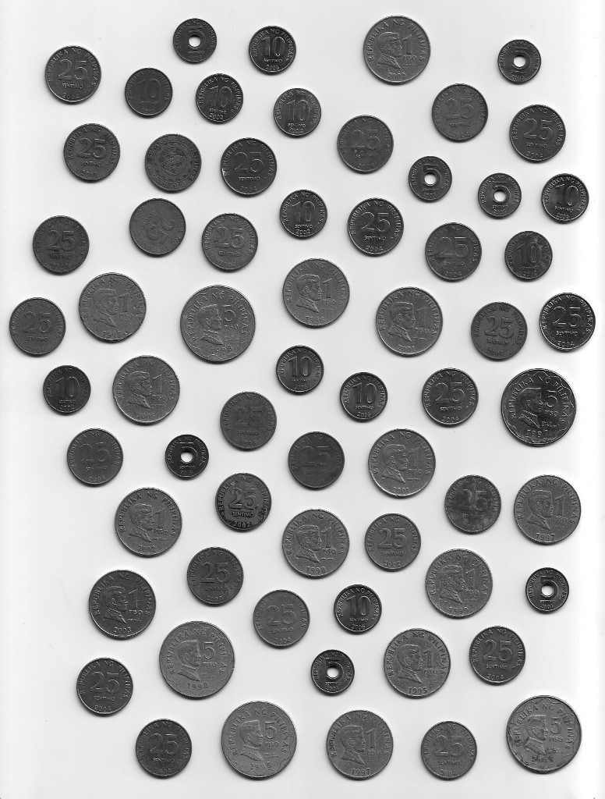
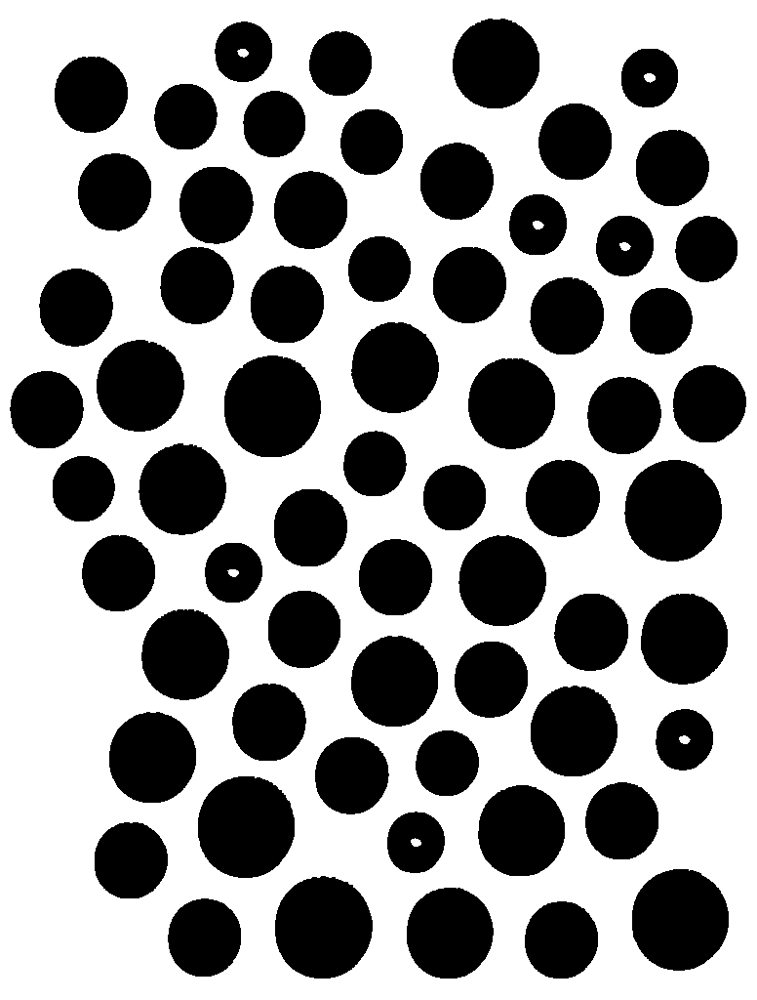
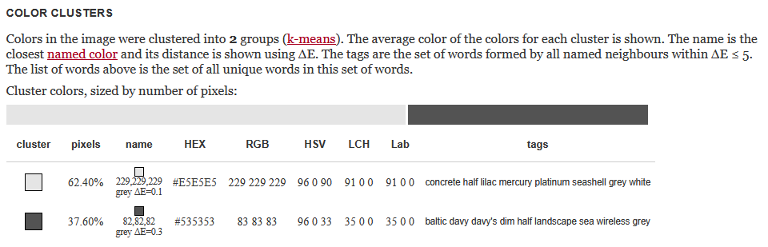

# Coin Counter & Classifier

This project processes an image of scattered coins, flattens the colors to remove noise, counts the coins, and groups them by their 5 denominations.

## Before and After

| Original (`coins.jpeg`) | Flattened (`coins_flattened.png`) |
| :---: | :---: |
|  |  |

### Expected Output (Manual Counting)
- **Total Coins:** 64
- **5 Cent:** 7 coins
- **10 Cent:** 11 coins
- **25 Cent:** 28 coins
- **1 Peso:** 13 coins
- **5 Peso:** 5 coins

### Program Output
```text
Loading image...
Background base color: C(229, 229, 229)
Finding islands using DFS...

Found 64 total coins.
Grouped into 5 coin denominations:
5 Cent (~2850 pixels): 7 coins
10 Cent (~3457 pixels): 11 coins
25 Cent (~4747 pixels): 28 coins
1 Peso (~6600 pixels): 13 coins
5 Peso (~8250 pixels): 5 coins
```

## How to Run

The program has already been compiled into `.exe` files in the [executables folder](executables).

1. Open the [executables folder](executables).
2. Double-click `ColorReducer.exe`. This will read the original `coins.jpeg` image and output a clean `coins_flattened.png` image with exactly two colors.
3. Next, open a terminal inside the [executables folder](executables) and run `IslandCounter.exe`. This will read the new `coins_flattened.png`, count all the coins, group them into the 5 sizes, and print the results to the screen!

## How it Works

The process is split into two main steps:

### 1. Color Reducer
First, I needed to clean up the image so it's easier to process. To find the best colors to represent the background and the coins, I used an online tool called [Color Summarizer](https://mk.bcgsc.ca/color-summarizer/?). By using its K-Means clustering feature, the tool analyzed the original image and found the two most dominant colors:
- **Background:** `#E5E5E5` (Light Grey)
- **Coins:** `#535353` (Dark Grey)



The `ColorReducer` script goes through every single pixel in the original image and changes it to whichever of those two colors it is closest to. To fix any tiny "noise" holes inside the coins caused by reflections, each pixel touching a coin pixel gets turned into a coin pixel. It then saves the result as a PNG file so we don't get any new compression artifacts.

### 2. Island Counter
Next, the program scans the clean image using a **Depth-First Search** algorithm to count the "islands" (the coins). 
- It skips any islands smaller than 1000 pixels since those are just dust or noise.
- Once it calculates the pixel areas of all the valid coins, it sorts them by size.
- Since we know there are exactly 5 coin denominations (5 Cent, 10 Cent, 25 Cent, 1 Peso, 5 Peso), the algorithm calculates the differences in size between the sorted coins. It automatically finds the 4 largest size gaps (natural breaks) and uses those as the split points to perfectly group the coins.

## Limitations

- **Image Quality & Clarity:** The program is limited to clear images of coins. Heavy shadows or overlapping coins could cause them to blend together.
- **Size-Based Classification:** Because the program groups the coins purely based on their surface area, coins from different denominations with a size difference that is small enough will confuse the program.